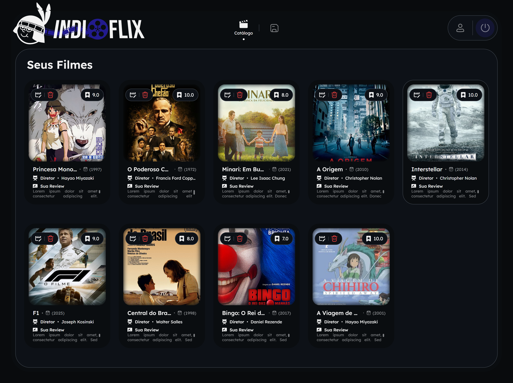
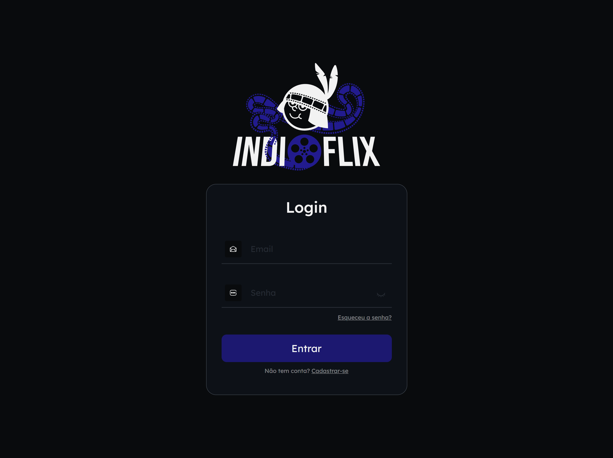

# 🎬 IndioFlix - Catálogo de Filmes Personalizado

O **IndioFlix** é uma aplicação Full Stack desenvolvida como projeto acadêmico para o gerenciamento de um catálogo de filmes pessoal. A plataforma permite que o usuário registre sua experiência cinematográfica, armazenando detalhes técnicos e avaliações subjetivas de cada obra.

---

## 🖼️ Demonstração da Interface

*Interface principal exibindo a listagem de filmes com cards interativos.*

---

## 📌 Sobre o Projeto

A aplicação foi construída sobre o conceito de **CRUD** completo:

* **Cadastrar:** Adicione filmes informando título, diretor, ano de lançamento, nota (ranking), uma review escrita e o link para a imagem da capa.
* **Visualizar:** Listagem dinâmica de filmes cadastrados com layout responsivo.
* **Atualizar:** Edite qualquer informação de um filme já existente.
* **Deletar:** Remova filmes do seu catálogo.

---

## 🚀 Tecnologias Utilizadas

### **Back-end (API REST)**
* **Java**
* **Spring Boot**
* **Bean Validation**: Para garantir que os dados enviados (como nota e ano) sejam válidos.
* **OpenAPI (Swagger)**: Documentação interativa dos endpoints.

### **Front-end**
* **HTML5 & CSS3**: Design moderno com foco em Dark Mode.
* **JavaScript**: Manipulação do DOM e consumo da API via Fetch API.

---

## 📂 Organização do Projeto (Back-end)

Seguindo as melhores práticas do ecossistema Spring, o projeto está organizado em pacotes:

* `Config`: Configurações globais como **CORS** e Swagger.
* `Controller`: Gerenciamento das rotas e requisições HTTP.
* `Services`: Camada de lógica de negócio.
* `Repository`: Abstração do banco de dados.
* `Model` (ou Entity): Definição das entidades (Classe `Filme`).

---

## 📷 Preview

Live demo by Vercel 🔼 🔗 https://indioflix-eight.vercel.app/

  
  

---

## 👤 Autores
Desenvolvido por **Gabriel Martins, Gabriel Rocha** e **Víctor Furtado** como parte do projeto de Java na Fatec Itapetininga